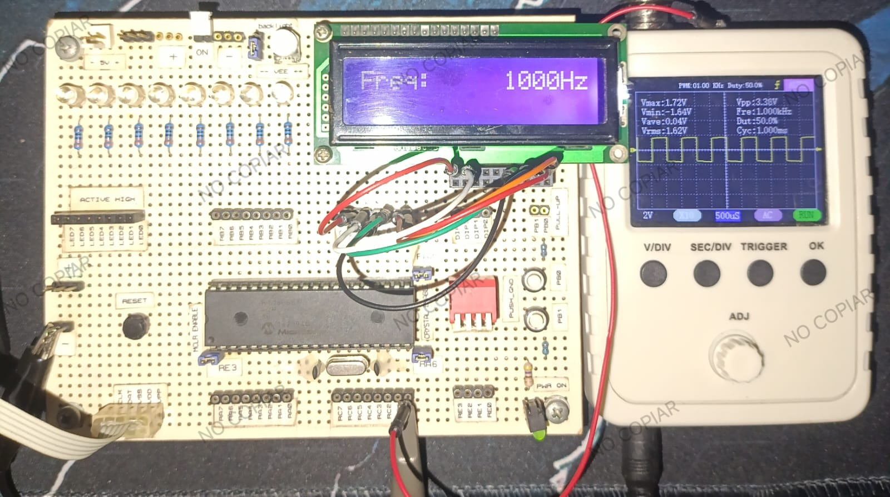

# 📟 Frequency Counter with PIC16F887

This project implements a simple yet effective **frequency counter** using a **PIC16F887** microcontroller running at **4 MHz**, programmed with **MikroC Pro for PIC**. It measures digital square wave signals up to **10 MHz**, displaying the result in Hertz on a 16x2 LCD.

## 🧠 How It Works

The circuit measures the frequency of a square wave signal applied to **Timer1's external clock input** (pin RC0/T1CKI) by **counting rising edges over a fixed 1-second interval**. The total number of counts equals the frequency in Hz.

### ⚙️ Base Principles

- **Timer1**: Used as a 16-bit counter. Overflows are tracked in a separate software counter to extend range beyond 65535 counts.
- **Timer0**: Configured to generate periodic interrupts every ~8ms. After 125 interrupts (≈1s), the total count from Timer1 is latched and displayed.
- **Interrupts**: Both Timer0 and Timer1 interrupts are used. Timer1 overflow extends the counter width; Timer0 controls the 1s measurement window.
- **LCD**: A standard HD44780-compatible 16x2 LCD displays the frequency in the format: Freq: 1234567Hz

## 🔌 Hardware Setup

- **Microcontroller**: PIC16F887 @ 4 MHz
- **LCD**: 16x2 display in 4-bit mode, connected to PORTD (RD0–RD5)
- **Input Signal**: Connect your square wave to **RC0/T1CKI (pin 16)**
- **Power**: 5V regulated supply
- **Debounced Reset**: Optional, for restarting measurement

Signal In → RC0/T1CKI (pin 16) LCD Pins → RD0–RD5 (4-bit mode)

## 🧪 Accuracy and Limitations

### ✅ Accuracy Examples:

| Input Frequency | Measured (Observed) | Error       |
|-----------------|---------------------|-------------|
| 1,000 Hz        | 1,000–1,001 Hz      | ±0.1%       |
| 10,000 Hz       | ~10,001 Hz          | ±0.01%      |
| 100,000 Hz      | ~100,100 Hz         | ±0.1%       |
| 1 MHz           | ~1,000,500 Hz       | ±0.05%      |
| 10 MHz          | ~10,013,000 Hz      | ±0.13%      |

- The accuracy is very good up to 1 MHz.
- Beyond 1 MHz, minor jitter and clock drift begin to introduce measurable error.
- Using a **crystal oscillator** rather than the internal RC clock is highly recommended for high precision.

### ℹ️ Resolution

- **1 Hz resolution** up to 65,535 Hz without overflow
- **Extended 32-bit counting** supports up to ~65 million Hz (limited by Timer1 and 1s window)

## 🛠️ Tools Used

- **IDE/Compiler**: [MikroC Pro for PIC](https://www.mikroe.com/mikroc/pic)
- **Language**: Embedded C
- **MCU Clock**: 4 MHz internal or external oscillator
- **LCD Library**: Built-in MikroC LCD library

## 🔧 Possible Improvements

- Use **Timer1 capture mode** to measure **period** for better low-frequency precision.
- Implement **averaging** or **moving average** filter to reduce jitter.
- Add **range auto-scaling** and units (kHz/MHz).
- Switch to **external crystal oscillator (e.g., 20 MHz)** for improved timing accuracy.

## 📸 Preview

## 👨‍💻 Author

Luis López  
[🔗 GitHub](https://github.com/lmla1)  
📍 Guadalajara, Jal. | 🧠 Embedded Systems Enthusiast

## 📜 License

This project is open-source under the MIT License.
